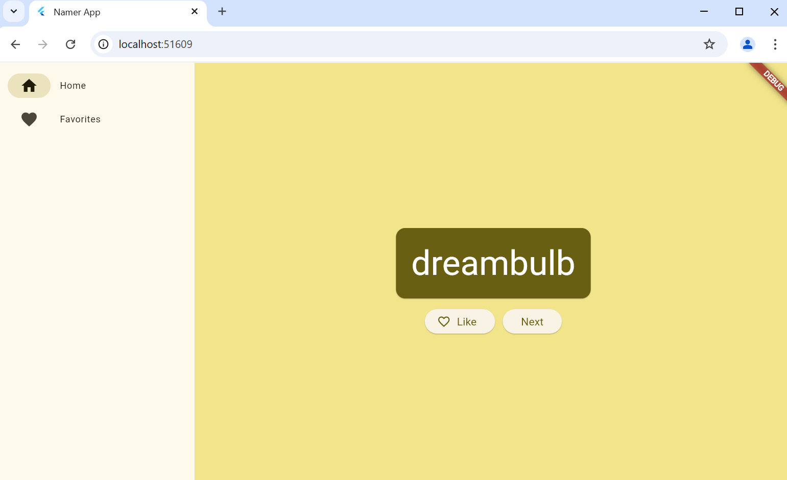
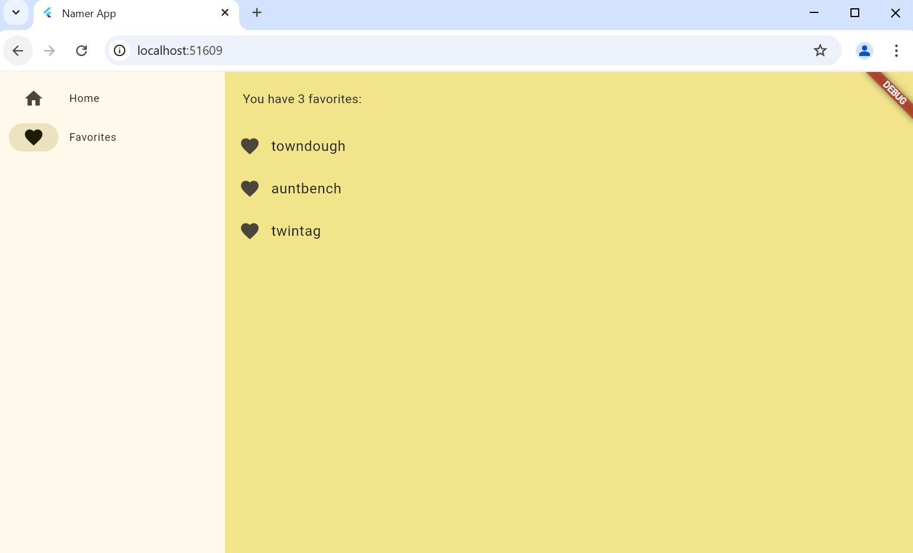

# my_first_app

Overview
Namer App is a simple Flutter application that generates random word pairs and allows users to save their favorite word combinations. It utilizes the Provider package for state management.

Features
Generates random word pairs using the english_words package.

Allows users to like/unlike word pairs and save them as favorites.

